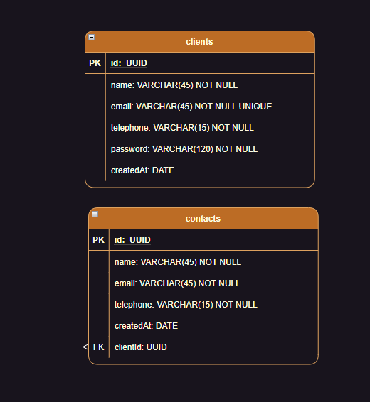

## Tabela de Conteúdos

- [Visão Geral](#1-visão-geral)
- [Diagrama ER](#2-diagrama-er)
- [Início Rápido](#3-início-rápido)
  - [Instalando Dependências](#31-instalando-dependências)
  - [Variáveis de Ambiente](#32-variáveis-de-ambiente)
  - [Migrations](#33-migrations)
- [Autenticação](#4-autenticação)
- [Endpoints](#5-endpoints)
- [Possíveis Erros](#6-possíveis-erros)
- [Contatos](#7-contatos)

## 1. Visão Geral

A API é uma agenda de contatos com cadastro de usuários, onde os usuários conseguem cadastrar contatos com telefone e e-mail.
Além de listar, editar e deletar seus contatos.

A API foi construída em TypeScript com Express.js/TypeORM no Node.js e utiliza o PostgreSQL como banco de dados.

Para as validações dos campos dos formulários foi utilizada a biblioteca Zod.

Maiores informações sobre alguma das tecnologias usadas.

- [NodeJS](https://nodejs.org/en/)
- [Express](https://expressjs.com/pt-br/)
- [TypeScript](https://www.typescriptlang.org/)
- [PostgreSQL](https://www.postgresql.org/)
- [TypeORM](https://typeorm.io/)
- [Zod](https://zod.dev/)

URL BASE para testes da aplicação:
http://localhost:3000/

---

## 2. Diagrama ER

[ Voltar para o topo ](#tabela-de-conteúdos)

Diagrama ER da API definindo bem as relações entre as tabelas do banco de dados.



---

## 3. Início Rápido

[ Voltar para o topo ](#tabela-de-conteúdos)

### 3.1. Instalando Dependências

Clone o projeto em sua máquina e instale as dependências com o comando:

```
npm install
```

### 3.2. Variáveis de Ambiente

Em seguida, crie um arquivo **.env**, copiando o formato do arquivo **.env.example**:

```
cp .env.example .env
```

Configure suas variáveis de ambiente com suas credenciais do Postgres e uma nova database da sua escolha.

### 3.3. Postgres

Crie a nova database que foi configurada no passo anterior:

Acesse o Postgres pelo GBD favorito ou pela Shell:

```
psql
```

Após digitar a senha do usuário, na shell do Postgres, crie o database a ser utilizado:

```
CREATE DATABASE <nome informado no passo 3.2>;
```

### 3.4 Migrations

Na Shell do terminal, execute as migrations com o comando:

```
npm run typeorm migration:run -- -d ./src/data-source
```

### 3.5 Inicialize o servidor

Na Shell do terminal, execute:

```
npm run dev
```

Caso todos os passos tenham sido executados corretamente, o terminal retornará:

```
Database connected.
App is running on http://localhost:3000
```

---

## 4. Autenticação

[ Voltar para o topo ](#tabela-de-conteúdos)

A autenticação é feita através do Token gerado no momento do Login na API.

---

## 5. Endpoints

[ Voltar para o topo ](#tabela-de-conteúdos)

### Índice

- [Clients](#1-clients)
  - [POST - /clients](#11-criação-de-cliente)
  - [GET - /clients](#12-listar-cliente)
  - [PATCH - /clients](#13-atualizar-cliente)
  - [DELETE - /clients](#14-deletar-cliente)
- [Login](#2-login)
  - [POST - /login](#21-realizar-login)
- [Contacts](#3-contacts)
  - [POST - /contacts](#31-criação-de-contato)
  - [GET - /contacts](#32-listar-contatos)
  - [PATCH - /contacts](#33-atualizar-contato)
  - [DELETE - /contacts](#34-deletar-contato)

---

## 1. **Clients**

[ Voltar para os Endpoints ](#5-endpoints)

O objeto Client é definido como:

| Campo     | Tipo   | Descrição                             |
| --------- | ------ | ------------------------------------- |
| id        | string | Identificador único do cliente (UUID) |
| name      | string | O nome completo do cliente            |
| email     | string | O e-mail do cliente                   |
| telephone | string | O telefone do cliente                 |
| password  | string | A senha de acesso do cliente          |
| createdAt | date   | Data do cadastro do cliente           |

### Endpoints

| Método | Rota     | Descrição                                            |
| ------ | -------- | ---------------------------------------------------- |
| POST   | /clients | Criação de um cliente                                |
| GET    | /clients | Lista um cliente usando seu ID capturado no Token    |
| UPDATE | /clients | Atualiza um cliente usando seu ID capturado no Token |
| DELETE | /clients | Deleta um cliente usando seu ID capturado no Token   |

---

### 1.1. **Criação de cliente**

[ Voltar para os Endpoints ](#5-endpoints)

### `/clients`

Esta rota não necessita de autenticação.

### Exemplo de Request:

```
POST /clients
Host: URL BASE
Authorization: None
Content-type: application/json
```

### Corpo da Requisição:

O id será gerado um UUID automaticamente.
O createdAt também será gerado, com a data do cadastro do cliente.
As chaves não necessárias serão removidas. Como exemplo a "chave_extra".

```json
{
  "name": "José Roberto da Silva",
  "email": "jose@mail.com.br",
  "telephone": "556266456646",
  "password": "1234",
  "chave_extra": "qualquer coisa escrita"
}
```

### Exemplo de Response:

| 201 Created |
| ----------- |

```json
{
  "id": "9cda28c9-e540-4b2c-bf0c-c90006d37893",
  "name": "José Roberto da Silva",
  "email": "jose@mail.com.br",
  "telephone": "556266456646",
  "createdAt": "2023-05-25"
}
```

### Possíveis Erros:

Caso não envie algum campo requerido, como password no exemplo.

| 400 Bad Request |
| --------------- |

```json
{
  "message": {
    "password": ["Required"]
  }
}
```

Caso tente passar um campo no formato inválido, como o telefone por exemplo.

| 400 Bad Request |
| --------------- |

```json
{
  "message": {
    "telephone": ["Expected string, received number"]
  }
}
```

Caso tente cadastrar um e-mail de cliente que já conste no database.

| 409 Conflict |
| ------------ |

```json
{
  "message": "Email already exists"
}
```

---

### 1.2. **Listar Cliente**

[ Voltar aos Endpoints ](#5-endpoints)

### `/clients`

Esta rota necessita de autenticação.

### Exemplo de Request:

```
GET /clients
Host: URL BASE
Authorization: Bearer Token
Content-type: application/json
```

### Corpo da Requisição:

```json
Vazio
```

### Exemplo de Response:

| 200 OK |
| ------ |

```json
{
  "id": "9cda28c9-e540-4b2c-bf0c-c90006d37893",
  "name": "José Roberto da Silva",
  "email": "jose@mail.com.br",
  "telephone": "556266456646",
  "createdAt": "2023-05-25",
  "contacts": [
    {
      "id": "1b47fa20-449e-4c4f-ba95-8ee5464c73a9",
      "name": "Contato1",
      "email": "contato1@mail.com",
      "telephone": "22983793010",
      "createdAt": "2023-05-24"
    },
    {
      "id": "47c61a53-e70f-4a30-a8b2-749391b0f308",
      "name": "Contato2",
      "email": "contato2@mail.com",
      "telephone": "22983793010",
      "createdAt": "2023-05-24"
    }
  ]
}
```

---

### 1.3. **Atualizar Cliente**

[ Voltar aos Endpoints ](#5-endpoints)

### `/clients/`

Esta rota necessita de autenticação.

### Exemplo de Request:

```
PATCH /clients/
Host: URL BASE
Authorization: Bearer Token
Content-type: application/json
```

### Corpo da Requisição:

Devem ser passados somente os dados a serem alterados, como exemplo o telefone.

```json
{
  "telephone": "55335345651"
}
```

### Exemplo de Response:

| 200 OK |
| ------ |

```json
{
  "id": "9cda28c9-e540-4b2c-bf0c-c90006d37893",
  "name": "José Roberto da Silva",
  "email": "jose@mail.com.br",
  "telephone": "55335345651",
  "createdAt": "2023-05-25"
}
```

---

### 1.4. **Deletar Cliente**

[ Voltar aos Endpoints ](#5-endpoints)

### `/clients/`

Esta rota necessita de autenticação.

### Exemplo de Request:

```
DELETE /clients/
Host: URL BASE
Authorization: Bearer Token
Content-type: application/json
```

### Corpo da Requisição:

```json
Vazio
```

### Exemplo de Response:

| 204 No Content |
| -------------- |

```json
Vazio
```

---

## 2. **Login**

[ Voltar para os Endpoints ](#5-endpoints)

### Endpoints

| Método | Rota   | Descrição                                        |
| ------ | ------ | ------------------------------------------------ |
| POST   | /login | Realiza login para a obtenção do Token de acesso |

### 2.1. **Realizar Login**

[ Voltar para os Endpoints ](#5-endpoints)

### `/login`

Esta rota não necessita de autenticação.

### Exemplo de Request:

```
POST /contacts
Host: URL BASE
Authorization: None
Content-type: application/json
```

### Corpo da Requisição:

As chaves não necessárias serão removidas. Como exemplo a "chave_extra".

```json
{
  "email": "jorge@mail.com",
  "password": "1234",
  "chave_extra": "qualquer coisa"
}
```

### Exemplo de Response:

| 200 OK |
| ------ |

```json
{
  "token": "eyJhbGciOiJIUzI1NiIsInR5cCI6IkpXVCJ9.yJlbWFpbCI6Impvc2VAbWFpbC5jb20uYnIiLCJpYXQiOjE
  dUwNDMxNjksIdV4cCI6MTY4NTA0Njc2OSwic3ViIjoiMzJhZTA0ODItYzI1NC00YWFkLWEwNWUtODBkYmZhNTliY.WZlI
  QtsPoO0O2fVj1YdlTDFrNrOqcRrOd6Ft8PO_txmfweffEhzU"
}
```

### Possíveis Erros:

Caso não envie algum campo requerido, como email no exemplo.

| 400 Bad Request |
| --------------- |

```json
{
  "message": {
    "email": ["Required"]
  }
}
```

Caso o usuário ou a senha passados sejam diferentes dos cadastrados no database.

| 403 Forbidden |
| ------------- |

```json
{
  "message": "Invalid credentials"
}
```

---

## 3. **Contacts**

[ Voltar para os Endpoints ](#5-endpoints)

O objeto Contact é definido como:

| Campo     | Tipo   | Descrição                              |
| --------- | ------ | -------------------------------------- |
| id        | string | Identificador único do contato (UUID)  |
| name      | string | O nome completo do contato             |
| email     | string | O e-mail do contato                    |
| telephone | string | O telefone do contato                  |
| createdAt | date   | Data que o cliente cadastrou o contato |

### Endpoints

| Método | Rota          | Descrição                                                           |
| ------ | ------------- | ------------------------------------------------------------------- |
| POST   | /contacts     | Criação de um contato                                               |
| GET    | /contacts     | Lista todos os contatos usando o ID do cliente (capturado no Token) |
| UPDATE | /contacts/:id | Atualiza um contato usando seu ID passado como parâmetro de rota    |
| DELETE | /contacts/:id | Deleta um contato usando seu ID passado como parâmetro de rota      |

---

### 3.1. **Criação de Contato**

[ Voltar para os Endpoints ](#5-endpoints)

### `/contacts`

Esta rota necessita de autenticação.

### Exemplo de Request:

```
POST /contacts
Host: URL BASE
Authorization: Bearer Token
Content-type: application/json
```

### Corpo da Requisição:

O id será gerado um UUID automaticamente.
O createdAt também será gerado, com a data do cadastro do contato.
As chaves não necessárias serão removidas. Como exemplo a "chave_extra".

```json
{
  "name": "Jorge Alberto Torres",
  "email": "jorge@mail.com",
  "telephone": "22983793010",
  "chave_extra": "qualquer coisa"
}
```

### Exemplo de Response:

| 201 Created |
| ----------- |

```json
{
  "id": "30643ccd-bff3-4dfe-8245-b0104481946d",
  "name": "Jorge Alberto Torres",
  "email": "jorge@mail.com",
  "telephone": "22983793010",
  "createdAt": "2023-05-25"
}
```

### Possíveis Erros:

Caso não envie algum campo requerido, como email no exemplo.

| 400 Bad Request |
| --------------- |

```json
{
  "message": {
    "email": ["Required"]
  }
}
```

Caso tente cadastrar um e-mail de contato que já conste no database.

| 409 Conflict |
| ------------ |

```json
{
  "message": "Email already exists"
}
```

Caso tente passar um campo no formato inválido, como o telefone por exemplo.

| 400 Bad Request |
| --------------- |

```json
{
  "message": {
    "telephone": ["Expected string, received number"]
  }
}
```

---

### 3.2. **Listar Contatos**

[ Voltar aos Endpoints ](#5-endpoints)

### `/contacts`

Esta rota necessita de autenticação.

### Exemplo de Request:

```
GET /contacts
Host: URL BASE
Authorization: Bearer Token
Content-type: application/json
```

### Corpo da Requisição:

```json
Vazio
```

### Exemplo de Response:

| 200 OK |
| ------ |

```json
[
  {
    "id": "30643ccd-bff3-4dfe-8245-b0104481946d",
    "name": "Jorge Alberto Torres",
    "email": "jorge@mail.com",
    "telephone": "22983793010",
    "createdAt": "2023-05-25"
  },
  {
    "id": "9ed2555b-00e0-49e2-a08d-51b8b38b31e7",
    "name": "Luiz Augusto Silva",
    "email": "luiz@mail.com",
    "telephone": "223446710",
    "createdAt": "2023-05-25"
  }
]
```

---

### 3.3. **Atualizar Contato**

[ Voltar aos Endpoints ](#5-endpoints)

### `/contacts/:id`

Esta rota necessita de autenticação.

### Exemplo de Request:

### Parâmetros da Requisição: -->

| Parâmetro  | Tipo   | Descrição                             |
| ---------- | ------ | ------------------------------------- |
| contact_id | string | Identificador único do contato (UUID) |

```
PATCH /contacts/
Host: URL BASE
Authorization: Bearer Token
Content-type: application/json
```

### Corpo da Requisição:

Devem ser passados somente os dados a serem alterados, como exemplo o telefone.

```json
{
  "telephone": "55343434556"
}
```

### Exemplo de Response:

| 200 OK |
| ------ |

```json
{
  "id": "9ed2555b-00e0-49e2-a08d-51b8b38b31e7",
  "name": "Luiz Augusto Silva",
  "email": "luiz@mail.com",
  "telephone": "55343434556",
  "createdAt": "2023-05-25"
}
```

---

### 3.4. **Deletar Contato**

[ Voltar aos Endpoints ](#5-endpoints)

### `/contacts/:id`

Esta rota necessita de autenticação.

### Exemplo de Request:

```
DELETE /contacts/
Host: URL BASE
Authorization: Bearer Token
Content-type: application/json
```

### Parâmetros de rota: -->

| Parâmetro  | Tipo   | Descrição                             |
| ---------- | ------ | ------------------------------------- |
| contact_id | string | Identificador único do contato (UUID) |

### Corpo da Requisição:

```json
Vazio
```

### Exemplo de Response:

| 204 No Content |
| -------------- |

```json
Vazio
```

---

## 6. **Possíveis Erros**

[ Voltar para o topo ](#tabela-de-conteúdos)

### Rotas autenticas:

Caso tente acessar sem passar um Token.

| 401 Unauthorized |
| ---------------- |

```json
{
  "message": "Missing bearer token"
}
```

Caso tente acessar com um Token no formato inválido.

| 401 Unauthorized |
| ---------------- |

```json
{
  "message": "jwt malformed"
}
```

Caso tente acessar com um Token inválido.

| 401 Unauthorized |
| ---------------- |

```json
{
  "message": "invalid token"
}
```

Caso tente acessar com o Token de um cliente que já foi deletado do database.

| 404 Not Found |
| ------------- |

```json
{
  "message": "Client not found"
}
```

---

### Rotas de Contatos, que exigem a passagem do ID por parâmetro:

Caso passe um ID em um formato diferente do UUID.

| 400 Bad Request |
| --------------- |

```json
{
  "message": "Invalid UUID format"
}
```

Caso passe um ID que não pertence a nenhum contato cadastrado.

| 404 Not Found |
| ------------- |

```json
{
  "message": "Contact not found"
}
```

---

## 7. Contatos

[ Voltar para o topo ](#tabela-de-conteúdos)

#### Dúvidas ou sugestões:

Não deixe de entrar em contato!!

E-mail: bigtam_rj@yahoo.com.br
Linkedin: https://www.linkedin.com/in/tamir-ferreira/
GitHub: https://github.com/tamir-ferreira
Portfólio: https://tamir-ferreira.vercel.app/
